**Tables and Figures**

**Figure 1.** Descriptive Statistics for Position of Founders Prior to Founding

### A. Positions (Role within Company) of Founders Prior to Founding

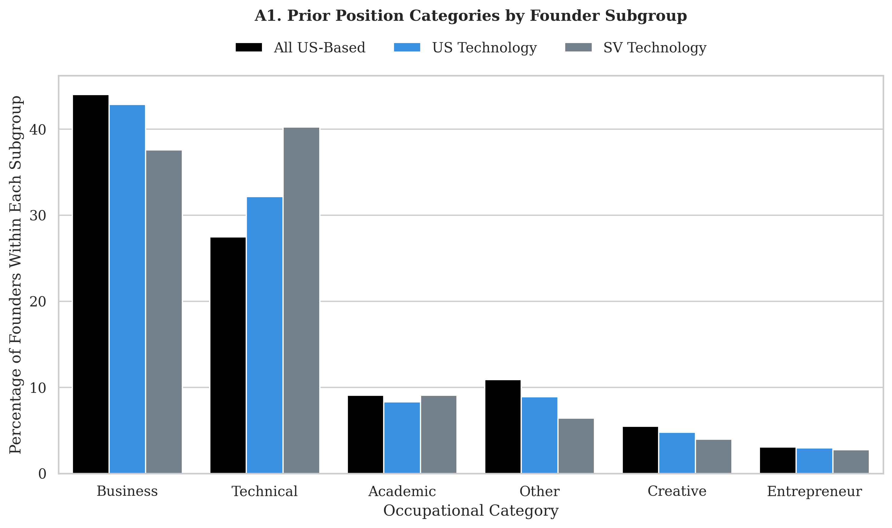

*Note:* Note. Data based on the position occupied by founders prior to founding. Percentages calculated as the share (%) of each sample. Sample of All US-Based Founders [All Industries] (black) indicates all founders, based in the US, across all industries. The sample is limited to those companies that have a LinkedIn profile and have completed LinkedIn surveys indicating characteristics of the founded company, such as firm size. A subsample of All US-Based Founders [Technology Companies] indicates a subsample of individuals, based in the US, who founded a company in a technology industry. The technology industry is defined broadly as Internet, Software, or Software Service companies. The subsample of Silicon Valley Based Founders [Technology Companies] indicates a subsample of individuals based in the “Bay Area” (Santa Clara and San Matteo County zip codes) who founded a company in a technology industry. This figure reflects the industry shares. Actual percentages are reported in Appendix A (Table A.A.1).

### B. Role of Founder Prior to Founding by Industry of Parent Firms  (Role and Industry in Firm Prior to Founding)

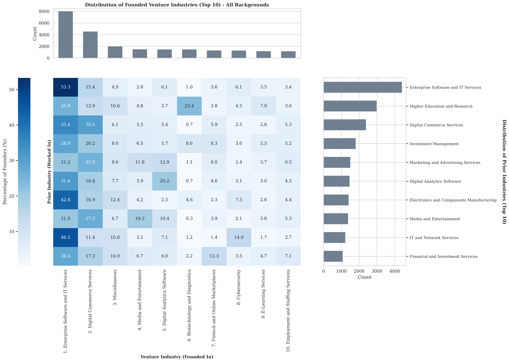

*Note:* Note. The term “entrepreneurial parent” refers to the employer of an individual prior to founding. This is an important metric, as this role often greatly shapes the nature of the company founded. We focused only on the 10 largest parent companies (size based on the number of companies created by founders) from these industries. The sample [Technology] indicates the sample of companies in the Internet, Software, or Software Services industries for workers that founded ventures across the US. The subsample Technology [Silicon Valley] indicates a further subsample of technology founders who established companies in the San Matteo or Santa Clara zip codes. The remaining subsets indicate founders who left the largest parent companies in various industries: Finance (e.g., Large Banks), Consulting (e.g., Large Consulting Companies), Health, Pharma, and Biotech (e.g., Pharmaceutical and Biotechnology companies), and Manufacturing and Defense (e.g., Defense Contractors).

**Figure 2.** Previous Role of Founders (Business vs. Technical)

by Size of Company Founded

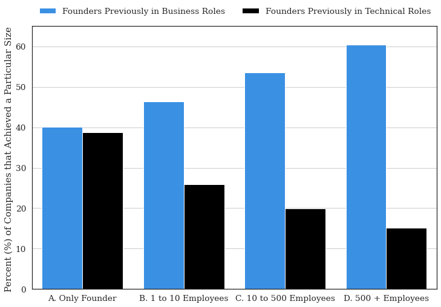

*Note.* Data based on the position occupied by founders prior to founding. Data is based on the sample of **Silicon Valley-based Technology Founders** [Results with alternative samples reported in Appendix]. The sample is stratified by the maximum size (number of employees) of the subsequently founded venture. The size of a subsequent venture can often be used as a proxy for the success of a particular venture, particularly when comparing firms within the same industry as we have done here (e.g., Stern and Guzman 2020). Vertical bars indicate the percentage of founders that previously held business (blue) or technical (black) roles prior to founding. The remainder represents other groups, such as academics, creatives, entrepreneurs, etc.  The composition of these groups did not change considerably.

**Table 1.** Results for Likelihood of Founding Regressions with Balanced Sample

**Outcome:** *Probability of Founding in Subsequent Position*

***Unit of Observation:*** *Individual Worker Position (Transition to Subsequent Position)*

**Sample:** *50% Sample of Positions Prior to Founding; 50% of Sample Positions Randomly Drawn from Population*

***Model:*** *OLS (Linear Probability Model). Coefficients interpreted as Probability of Becoming a Founder in Subsequent Position*

|   | (1) | (2) |   | (3) | (4) | (5) | (6) |   | (7) | (8) |
| --- | --- | --- | --- | --- | --- | --- | --- | --- | --- | --- |
|   | Full Sample | Full Sample |   | Tech. | Non-Tech | Tech | Non-Tech |   | Matched Sample | Matched Sample |
|   |   |   |   |   |   |   |   |   |   |   |
| Business Roles | 0.086 | 0.081 |   | 0.102 | 0.066 | 0.107 | 0.077 |   | 0.082 | 0.065 |
| (Baseline: Technical Roles) | (0.007) | (0.007) |   | (0.009) | (0.011) | (0.010) | (0.014) |   | (0.008) | (0.019) |
|   | [0.000] | [0.000] |   | [0.000] | [0.000] | [0.000] | [0.000] |   | [0.000] | [0.001] |
| STEM Degree | 0.091 | 0.065 |   | 0.052 | 0.078 | 0.062 | 0.076 |   | 0.065 | 0.078 |
|   | (0.006) | (0.007) |   | (0.008) | (0.010) | (0.009) | (0.014) |   | (0.007) | (0.018) |
|   | [0.000] | [0.000] |   | [0.000] | [0.000] | [0.000] | [0.000] |   | [0.000] | [0.000] |
| CONTROLS |   |   |   |   |   |   |   |   |   |   |
| Education | Yes | Yes |   | Yes | Yes | Yes | Yes |   | Yes | Yes |
| Year FE | Yes | Yes |   | Yes | Yes | Yes | Yes |   |   |   |
| Gender FE |   | Yes |   | Yes | Yes | Yes | Yes |   |   |   |
| Employer Company Size FE |   | Yes |   | Yes | Yes | Yes | Yes |   |   |   |
| Matched Pair FE |   |   |   |   |   |   |   |   | Yes | Yes |
| MATCHING VARIABLES |   |   |   |   |   |   |   |   |   |   |
| Gender |   |   |   |   |   |   |   |   | Yes |   |
| Industry |   |   |   |   |   |   |   |   | Yes |   |
| Year |   |   |   |   |   |   |   |   | Yes | Yes |
| Company (Previous Employer) |   |   |   |   |   |   |   |   |   | Yes |
|   |   |   |   |   |   |   |   |   |   |   |
| Constant | 0.374 | 0.459 |   | 0.448 | 0.455 | 0.428 | 0.500 |   | 0.372 | 0.372 |
|   | (0.007) | (0.042) |   | (0.052) | (0.074) | (0.058) | (0.097) |   | (0.007) | (0.015) |
|   | [0.000] | [0.000] |   | [0.000] | [0.000] | [0.000] | [0.000] |   | [0.000] | [0.000] |
| N | 26262 | 26262 |   | 17218 | 9044 | 14073 | 5327 |   | 25964 | 5381 |
| R2 | 0.036 | 0.125 |   | 0.121 | 0.149 | 0.129 | 0.169 |   | 0.141 | 0.371 |
| F | 177.004 | 300.089 |   | 175.193 | 127.198 | 159.135 | 92.871 |   | 106.693 | 13.814 |

**Note.** *Robust Standard Errors in (round) Parentheses. Exact p values to three decimals reported in [square] brackets. Results based on Linear Probability Model (OLS regression with a binary response variable).*

*Unit of Observation (Analysis) is based on a focal role occupied by an individual and the role subsequently occupied. The outcome variable is an indicator of whether an individual founded a company in a subsequent role or* *continued on* *into paid employment. Because founding is a rare event, we constructed the sample by oversampling founders with respect to non-founders. As a result, the dataset is based 50% on individuals who subsequently found a company and 50% on individuals who change companies in the same year but do not become entrepreneurs.*

*The coefficients can be interpreted as the difference in the percentage difference between the likelihood of an individual becoming a founder if an individual is working in a technical role versus a business role (e.g., Column 2; Coefficient of 0.081 indicates that founders from business roles are 19.0% likelier to become founders when transitioning to a subsequent role).*

*In Columns 1 and 2, the results are reported for the entire sample of founders and* *nonfounders**. In Column 2, the sample is limited to individuals who subsequently found in the technology sector (or work in the technology sector), while in Column 3, the results are for those in non-technology sectors. In Columns 3 and 4, the samples are also limited to individuals who also previously worked in technology or non-technology industries, respectively.*

*In Columns 7 and 8, we perform matching to ensure a comparable set of individuals from technical or business roles. Exact matching is performed based on variables indicated, and then fixed effects are implemented at the level of the matched pairs (e.g., Prior Employer and Year).*

**Table 2.** Results for Likelihood of Founding Regressions with Balanced Samples and Alternative Controls

**Outcome:** *Probability of Founding in Subsequent Position*

***Unit of Observation:*** *Individual Worker Position (Transition to Subsequent Position)*

**Sample:** *50% Sample of Positions Prior to Founding; 50% of Sample Positions Randomly Drawn from Population*

***Model:*** *OLS (Linear Probability Model). Coefficients interpreted as Probability of Becoming a Founder in Subsequent Position*

|   | (1) | (2) | (3) |   | (4) | (5) |
| --- | --- | --- | --- | --- | --- | --- |
|   | Full Sample | Full Sample | Full Sample |   | Matched Sample | Matched Sample |
|   |   |   |   |   |   |   |
| Business Roles | 0.094 | 0.045 | 0.088 |   | 0.028 | 0.063 |
| (Baseline: Technical Roles) | (0.007) | (0.009) | (0.007) |   | (0.026) | (0.018) |
|   | [0.000] | [0.000] | [0.000] |   | [0.285] | [0.000] |
| STEM Degree | 0.079 | 0.004 |   |   | 0.042 |   |
|   | (0.006) | (0.011) |   |   | (0.029) |   |
|   | [0.000] | [0.730] |   |   | [0.148] |   |
| Business Roles |   | 0.116 |   |   | 0.084 |   |
| X STEM (Any Degree) |   | (0.013) |   |   | (0.039) |   |
|   |   | [0.000] |   |   | [0.033] |   |
| STEM Bachelor’s degree |   |   | 0.025 |   |   | 0.030 |
|   |   |   | (0.008) |   |   | (0.021) |
|   |   |   | [0.001] |   |   | [0.157] |
| STEM Master’s degree |   |   | 0.044 |   |   | 0.080 |
|   |   |   | (0.011) |   |   | (0.031) |
|   |   |   | [0.000] |   |   | [0.009] |
| STEM Doctorate Degree |   |   | 0.175 |   |   | 0.129 |
|   |   |   | (0.020) |   |   | (0.059) |
|   |   |   | [0.000] |   |   | [0.028] |
| CONTROLS |   |   |   |   |   |   |
| Year FE | Yes | Yes | Yes |   |   |   |
| Gender FE | Yes | Yes | Yes |   |   |   |
| Employer Company Size FE | Yes | Yes | Yes |   |   |   |
| Matched Pair FE |   |   |   |   | Yes | Yes |
| MATCHING VARIABLES |   |   |   |   |   |   |
| Year |   |   |   |   | Yes | Yes |
| Company (Previous Employer) |   |   |   |   | Yes | Yes |
|   |   |   |   |   |   |   |
| Constant | 0.473 | 0.507 | 0.480 |   | 0.843 | 0.843 |
|   | (0.042) | (0.043) | (0.042) |   | (0.130) | (0.133) |
|   | [0.000] | [0.000] | [0.000] |   | [0.000] | [0.000] |
| N | 26262 | 26262 | 26262 |   | 5339 | 5339 |
| R2 | 0.114 | 0.116 | 0.112 |   | 0.373 | 0.370 |
| F | 325.310 | 309.041 | 271.860 |   | 6.025 | 4.250 |

**Note.** *Robust Standard Errors in (round) Parentheses. Exact p values to three decimals reported in [square] brackets. Results based on Linear Probability Model (OLS regression with a binary response variable).*

*Unit of Observation (Analysis) is based on a focal role occupied by an individual and the role subsequently occupied. The outcome variable is an indicator of whether an individual founded a company in a subsequent role or* *continued on* *into paid employment.*

**Table** **3****.** Results for Likelihood of Founding a High-Growth Venture within Founder Sample

**Outcome:** *Probability of Founding a High-Growth Venture (More than 500 Employees)*

***Unit of Observation:*** *Individual Founders Transition to Entrepreneurship*

**Sample:** *Sample of Founders in Positions Prior to Founding (Low-Growth and High-Growth Founders)*

***Model:*** *OLS (Linear Probability Model). Coefficients interpreted as Probability of* *Subsequently founding a High-Growth Venture*

|   | (1) | (2) |   | (3) | (4) | (5) | (6) |   | (7) | (8) |
| --- | --- | --- | --- | --- | --- | --- | --- | --- | --- | --- |
|   | Full Sample | Full Sample |   | Non-Tech | Tech | Non-Tech | Tech |   | Matched Sample | Matched Sample |
|   |   |   |   |   |   |   |   |   |   |   |
| Business Roles | 0.010 | 0.011 |   | 0.012 | 0.010 | 0.016 | 0.014 |   | 0.011 | 0.014 |
| (Baseline: Technical Roles) | (0.003) | (0.003) |   | (0.004) | (0.005) | (0.005) | (0.007) |   | (0.004) | (0.006) |
|   | [0.001] | [0.001] |   | [0.003] | [0.030] | [0.003] | [0.046] |   | [0.005] | [0.029] |
| STEM Degree | -0.003 | -0.003 |   | -0.004 | -0.000 | -0.003 | 0.001 |   | -0.004 | 0.000 |
|   | (0.003) | (0.003) |   | (0.004) | (0.005) | (0.005) | (0.007) |   | (0.003) | (0.008) |
|   | [0.262] | [0.328] |   | [0.310] | [0.955] | [0.522] | [0.866] |   | [0.205] | [0.953] |
| CONTROLS |   |   |   |   |   |   |   |   |   |   |
| Education | Yes | Yes |   | Yes | Yes | Yes | Yes |   | Yes | Yes |
| Year FE | Yes | Yes |   | Yes | Yes | Yes | Yes |   |   |   |
| Gender FE |   | Yes |   | Yes | Yes | Yes | Yes |   |   |   |
| Employer Company Size FE |   | Yes |   | Yes | Yes | Yes | Yes |   |   |   |
| Matched Pair FE |   |   |   |   |   |   |   |   | Yes | Yes |
| MATCHING VARIABLES |   |   |   |   |   |   |   |   |   |   |
| Gender |   |   |   |   |   |   |   |   | Yes |   |
| Industry |   |   |   |   |   |   |   |   | Yes |   |
| Year |   |   |   |   |   |   |   |   | Yes | Yes |
| Company (Previous Employer) |   |   |   |   |   |   |   |   |   | Yes |
|   |   |   |   |   |   |   |   |   |   |   |
| Constant | 0.020 | -0.000 |   | -0.000 | -0.003 | 0.002 | 0.020 |   | 0.019 | 0.016 |
|   | (0.003) | (0.006) |   | (0.006) | (0.015) | (0.008) | (0.012) |   | (0.004) | (0.006) |
|   | [0.000] | [0.978] |   | [0.944] | [0.843] | [0.821] | [0.095] |   | [0.000] | [0.010] |
| N | 12584 | 12584 |   | 7704 | 4880 | 5623 | 2548 |   | 12262 | 2671 |
| R2 | 0.035 | 0.044 |   | 0.051 | 0.070 | 0.065 | 0.069 |   | 0.083 | 0.252 |
| F | 3.532 | 8.214 |   | 6.064 | 3.925 | 5.530 | 3.611 |   | 3.060 | 1.828 |

**Note.** *Robust Standard Errors in (round) Parentheses. Exact p values to three decimals reported in [square] brackets. Results based on Linear Probability Model (OLS regression with a binary response variable).*

*Unit of Observation (Analysis) is based on a focal position, occupied by a founder, prior to founding. We focus on the sample of founders from Table 1 and Table* *2, and* *estimate the* *likelihood that a subsequent venture founded is high-growth (employs more than 500 individuals).*

*The coefficients can be interpreted as the difference in the percentage difference between the likelihood of an individual founding a high-growth, versus a lower-growth venture (fewer than 500 employees), if an individual is working in a technical role versus a business role (e.g., Column 2; indicates that founders from business roles are 90.0% likelier to become a high-growth founder if they working in a business role; Column 8 indicates a 80% difference).*

*In Columns 1 and 2, the results are reported for the entire sample of founders. In Column 2, the sample is limited to individuals who subsequently found in the technology sector (or work in the technology sector), while in Column 3, the results are for those in non-technology sectors. In Columns 3 and 4, the samples are also limited to individuals who also previously worked in technology or non-technology industries, respectively. In Columns 7 and 8, we perform matching to ensure a comparable set of individuals from technical or business roles. Exact matching is performed based on variables indicated, and then fixed effects are implemented at the level of the matched pairs (e.g., Prior Employer and Year). Results of Column 8 indicate the difference between founders who leave the same parent company* *in a given year**, and subsequently found an entrepreneurial venture but may have previously worked in a business or technology role.*

**Table** **4****.** Results for Likelihood of Founding Regressions with Alternative Specifications

**Outcome:** *Probability of Founding a High-Growth Venture (More than 500 Employees)*

***Unit of Observation:*** *Individual Founders Transition to Entrepreneurship*

**Sample:** *Sample of Founders in Positions Prior to Founding (Low-Growth and High-Growth Founders)*

***Model:*** *OLS (Linear Probability Model). Coefficients interpreted as Probability of Subsequently founding a High-Growth Venture*

|   | (1) | (2) | (3) |   | (4) | (5) |
| --- | --- | --- | --- | --- | --- | --- |
|   | Full Sample | Full Sample | Full Sample |   | Matched Sample | Matched Sample |
|   |   |   |   |   |   |   |
| Business Roles | 0.011 | 0.011 | 0.011 |   | 0.014 | 0.014 |
| (Baseline: Technical Roles) | (0.003) | (0.004) | (0.003) |   | (0.009) | (0.006) |
|   | [0.000] | [0.011] | [0.000] |   | [0.040] | [0.034] |
| STEM Degree | -0.002 | -0.002 |   |   | -0.002 |   |
|   | (0.003) | (0.005) |   |   | (0.009) |   |
|   | [0.459] | [0.628] |   |   | [0.806] |   |
| Business Roles |   | 0.000 |   |   | -0.002 |   |
| X STEM (Any Degree) |   | (0.006) |   |   | (0.011} |   |
|   |   | [0.986] |   |   | [0.825] |   |
| STEM Bachelor’s degree |   |   | -0.000 |   |   | 0.005 |
|   |   |   | (0.003) |   |   | (0.007) |
|   |   |   | [0.892] |   |   | [0.461] |
| STEM Master’s degree |   |   | -0.001 |   |   | -0.010 |
|   |   |   | (0.005) |   |   | (0.009) |
|   |   |   | [0.872] |   |   | [0.304] |
| STEM Doctorate Degree |   |   | 0.013 |   |   | -0.023 |
|   |   |   | (0.011) |   |   | (0.012) |
|   |   |   | [0.228] |   |   | [0.057] |
| CONTROLS |   |   |   |   |   |   |
| Year FE | Yes | Yes | Yes |   |   |   |
| Gender FE | Yes | Yes | Yes |   |   |   |
| Employer Company Size FE | Yes | Yes | Yes |   |   |   |
| Matched Pair FE |   |   |   |   | Yes | Yes |
| MATCHING VARIABLES |   |   |   |   |   |   |
| Year |   |   |   |   | Yes | Yes |
| Company (Previous Employer) |   |   |   |   | Yes | Yes |
|   |   |   |   |   |   |   |
| Constant | 0.002 | 0.002 | 0.001 |   | -0.017 | -0.017 |
|   | (0.006) | (0.006) | (0.006) |   | (0.032) | (0.033) |
|   | [0.799] | [0.806] | [0.927] |   | [0.592] | [0.600] |
| N | 12584 | 12584 | 12584 |   | 2541 | 2541 |
| R2 | 0.044 | 0.044 | 0.044 |   | 0.284 | 0.285 |
| F | 10.202 | 9.356 | 8.645 |   | 2.424 | 1.942 |

**Note.** *Robust Standard Errors in (round) Parentheses. Exact p values to three decimals reported in [square] brackets. Results based on Linear Probability Model (OLS regression with a binary response variable).*

### Appendix A. Detailed Information About Data From Figures

A. Positions (Role) of Founders Prior to Founding

In this paper, we report the type of role (position) held by founders prior to establishing a company, split across different samples [Figure 1]. In Table A.A.1, we report the raw percentages listed in the figure.

|   | Sample | Sample | Sample |
| --- | --- | --- | --- |
| Type of Role Held by Founders Prior to Founding | US Based Founders  [All Industries] | US Based Founders [Technology Companies] | Silicon Valley Founders [Technology Companies] |
| Academic | 0.10 | 0.06 | 0.07 |
| Business | 0.49 | 0.49 | 0.47 |
| Creative | 0.03 | 0.02 | 0.02 |
| Entrepreneur | 0.12 | 0.14 | 0.16 |
| Other | 0.14 | 0.06 | 0.05 |
| Technical | 0.12 | 0.23 | 0.24 |

**Table A.A.1.** Share of Positions (Roles) Held By Founders Prior to Founding

The classification of these groups is based on a clustering of positions. There are several hundred unique positions. To provide an overview of the specific roles, we report the 10 most common positions (rank-ordered) in each broad cluster of roles. See Table A.A.2.

| Rank | Business Roles | Technical Roles | Academic Roles | Other Roles | Creative Roles |
| --- | --- | --- | --- | --- | --- |
| 1 | Salesperson | Software Developer | Student | Journalist | Creative Designer |
| 2 | Executive Director | IT Consultant | Research Fellow | Education Administrator | Marketing Creative Designer |
| 3 | Business Strategist | Engineer | University Professor | Production Editor | Arts Professional |
| 4 | Marketing Specialist | Website Manager | School Teacher | Lawyer | Fashion Designer |
| 5 | Consultant | IT Support Specialist | Research Analyst | Recreation Professional | Industrial Designer |
| 6 | Technology Manager | IT System Administrator | Laboratory Scientist | Community Dev. Specialist | Interior Designer |
| 7 | Product Manager | User Experience Designer | Laboratory Technician | Food Service Professional | Graphic Designer |
| 8 | Project Manager | Database Developer | Clinical Research Specialist | Author | Print Specialist |
| 9 | Business Development Specialist | Product Development Engineer | Pharmaceutical  Scientist | Entertainment Administrator | Computer Aided Designer |

**Table A.A.2.** Example of Job Titles in Each Type of Role

B. Parent Firms of Founders from Different Industries

In Section 3.A, we discuss the parent companies of the founders. The term “parent company” refers to the previous employer of a founder. Often, much of a venture is shaped by the professional experience of a founder, and an “imprinting” of practices and experiences from a previous role, translate into the entrepreneurial venture that is founded. In Table A.B.1, we report the share of founders from business and technology roles that move into entrepreneurship. Here we report the percentages for all types of roles and for each of the samples (US-based founders and Silicon Valley-based founders).

| Role Prior to Founding | US Based Founders | US Based Founders | US Based Founders | US Based Founders | US Based Founders |   | Silicon Valley Based Founders |
| --- | --- | --- | --- | --- | --- | --- | --- |
| Role Prior to Founding | Consulting | Finance | Health, Pharma and Biotech | Manufacturing and Defense | Technology |   | Technology |
| Business | 0.56 | 0.64 | 0.53 | 0.35 | 0.49 |   | 0.46 |
| Technical | 0.09 | 0.09 | 0.12 | 0.37 | 0.30 |   | 0.33 |
| Academic | 0.06 | 0.05 | 0.12 | 0.12 | 0.08 |   | 0.08 |
| Other | 0.05 | 0.07 | 0.16 | 0.10 | 0.05 |   | 0.05 |
| Creative | 0.00 | 0.00 | 0.01 | 0.01 | 0.02 |   | 0.02 |
| Entrepreneur | 0.04 | 0.01 | 0.00 | 0.01 | 0.01 |   | 0.01 |

**Table A.B.1** Share of Positions (Roles) held By Founders Across Industries

*Note.* Columns indicate the industry / role in which a worker was previously employed prior to founding. Percentages indicate the share of individuals who left consulting to found a company and the distribution of the roles they left.

A useful reference point in interpreting these magnitudes is the share of workers in each industry (within each of the companies in the sample defined above) that belong to each type of role. Below, we report the share of workers in each industry that come from business / technology roles. If we consider the share of US-based technology founders that come from companies (business, technical, creative, or other roles), then approximately 32% come from technical roles and 53% come from business roles. This is quite similar to the baseline share of workers in these industries.

**Table A.B.2.** Share of Positions (Roles) held By Founders Across Industries

| Company Type | Business | Creative | Technical | Other |
| --- | --- | --- | --- | --- |
| Consulting | 0.68 | - | 0.13 | 0.19 |
| Finance | 0.73 | - | 0.12 | 0.15 |
| Health, Pharma and Biotech | 0.52 | - | 0.18 | 0.29 |
| Manufacturing and Defense | 0.39 | 0.01 | 0.39 | 0.21 |
| Technology | 0.57 | 0.01 | 0.29 | 0.14 |

C. Previous Role of Founders by Size of Company Founded

In Section 3.B, we report basic results only for founders that came from academic or technical roles, and only for the sample of US-based Technology Companies. Here, for each subsample, we stratify by the size of the venture subsequently founded (as firm size—especially within industries—can serve as a proxy of success); we report the share of founders that come from different roles, including all the other roles that are less common.

Once again, the sample here is based on founders who established a business between 2005 and 2015, and who’s business existed for at least three years. Ventures that remained small even after three years were considered to have lower growth (Groups A and B). Ventures that grew to be larger in size were considered higher growth and therefore more successful ventures (particularly Group D).

**Table A.C.1.** Role of Founders by Size of Company Founded

**I. Founders of US-Based Companies (All Industries)**

|   | Size of Company Founded | Size of Company Founded | Size of Company Founded | Size of Company Founded |
| --- | --- | --- | --- | --- |
| Role Prior to Founding | A. Only Founder | B. 1 to 10 Employees | C. 10 to 500 Employees | D. 500 + Employees |
| Academic | 0.09 | 0.08 | 0.07 | 0.14 |
| Business | 0.50 | 0.50 | 0.54 | 0.49 |
| Creative | 0.04 | 0.04 | 0.02 | 0.01 |
| Entrepreneur | 0.06 | 0.09 | 0.13 | 0.10 |
| Other | 0.15 | 0.14 | 0.10 | 0.17 |
| Technical | 0.17 | 0.15 | 0.13 | 0.09 |

**II. Founders of US-Based Technology Companies**

|   | Size of Company Founded | Size of Company Founded | Size of Company Founded | Size of Company Founded |
| --- | --- | --- | --- | --- |
| Role Prior to Founding | A. Only Founder | B. 1 to 10 Employees | C. 10 to 500 Employees | D. 500 + Employees |
| Academic | 0.05 | 0.07 | 0.04 | 0.03 |
| Business | 0.40 | 0.46 | 0.54 | 0.60 |
| Creative | 0.02 | 0.02 | 0.01 | 0.00 |
| Entrepreneur | 0.06 | 0.11 | 0.15 | 0.13 |
| Other | 0.08 | 0.08 | 0.06 | 0.08 |
| Technical | 0.39 | 0.26 | 0.20 | 0.15 |

|   | Size of Company Founded | Size of Company Founded | Size of Company Founded | Size of Company Founded |
| --- | --- | --- | --- | --- |
| Role Prior to Founding | A. Only Founder | B. 1 to 10 Employees | C. 10 to 500 Employees | D. 500 + Employees |
| Academic | 0.08 | 0.10 | 0.08 | 0.07 |
| Business | 0.47 | 0.46 | 0.51 | 0.59 |
| Creative | 0.03 | 0.04 | 0.02 | 0.01 |
| Entrepreneur | 0.03 | 0.10 | 0.15 | 0.10 |
| Other | 0.13 | 0.10 | 0.07 | 0.10 |
| Technical | 0.27 | 0.19 | 0.18 | 0.13 |

**III. Founders of Silicon Valley–Based Technology Companies**

D. Education and Field-of-Study of Founders

In Section 3.C, we report the share of founders with a degree in a STEM, Business, or Law and Humanities discipline. Below, we report the raw percentages as well as examples of the top fields of study for each group.

| Sample | Business | Law and Humanities | STEM |
| --- | --- | --- | --- |
| US Based Founders [All Industries] | 46% | 30% | 29% |
| US Based Founders [Technology Companies] | 41% | 23% | 49% |
| Silicon Valley Based Founders [Technology Companies] | 35% | 22% | 60% |

**Table A.D.1.** Percentage of Founders with a Degree in a Particular Field of Study

**Table A.D.2.** Top 5 Most Common Degree Areas (Fields of Study) for Sample of Founders of US-Based Technology Firms

| STEM Fields of Study | % | Business Fields of Study | % | Humanities Fields of Study | % |
| --- | --- | --- | --- | --- | --- |
| Engineering (All) | 44% | Business, Commerce and Management (All) | 49% | Political Science and Government | 14% |
| Computer Science | 25% | Marketing (All) | 14% | Psychology | 13% |
| Mathematics and Statistics | 10% | Economics | 14% | Design and Visual Communications, General | 8% |
| Biology (All) | 9% | Finance (All) | 12% | Communication, General | 7% |
| Physics (All) | 6% | Accounting (All) | 4% | History | 7% |

E. Positions Previously Occupied by Founder by Gender

In Section 3.D, we report the share of men versus women founders that come from each type of role prior to founding. We report the results for the sample of US-based technology founders. Below, we report these results for each subsample in our analysis.

**Table A.E.1.** Position Held Prior to Founding (Percentage of Male / Female Founders) Stratified by Gender for Each Sample of Founders

| Position Prior to Founding | US Based Founders [All Industries] | US Based Founders [All Industries] |   | US Based Founders [Technology Industries] | US Based Founders [Technology Industries] |   | Silicon Valley Based Founders [Technology Industries] | Silicon Valley Based Founders [Technology Industries] |
| --- | --- | --- | --- | --- | --- | --- | --- | --- |
| Position Prior to Founding | FEMALE | MALE |   | FEMALE | MALE |   | FEMALE | MALE |
| Academic | 12.47 | 8.29 |   | 7.91 | 6.01 |   | 7.84 | 6.71 |
| Business | 48.77 | 50.03 |   | 52.14 | 48.67 |   | 51.48 | 46.79 |
| Creative | 3.76 | 2.68 |   | 2.43 | 1.48 |   | 2.58 | 1.57 |
| Entrepreneur | 9.05 | 13.12 |   | 11.62 | 14.31 |   | 13.76 | 15.74 |
| Other | 19.23 | 11.79 |   | 9.44 | 5.87 |   | 6.98 | 4.89 |
| Technical | 6.73 | 14.08 |   | 16.45 | 23.67 |   | 17.37 | 24.29 |
|   |   |   |   |   |   |   |   |   |

### Appendix B. Supplementary Analysis and Robustness Checks

Business Backgrounds, Age, and Experience

As discussed in Section 3.A, experience in business roles and individual age are linked. Individuals tend to gain experience in business roles as they mature in their careers. Therefore, we might expect individuals from business roles to have more experience (Mean = 12.18 years; Median = 13 years) than those from technical roles (Mean = 10.81 years; Median = 11 years). We illustrate the distribution of career age for founders from different roles in **Figure B.A.1**.

**Figure B.A.1.** Distribution of Career Age of Founders from Business and Technical Roles [Sample of US-Based Technology Founders]

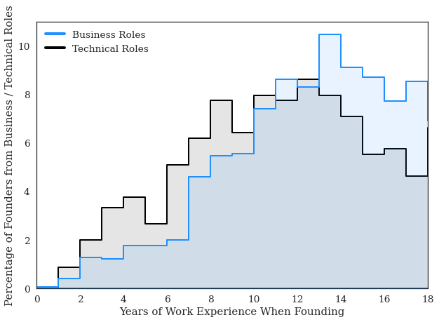

Note. Based on a sample of founders who first entered the labor market between 2000 and 2002, followed through to 2018. Histogram indicates the percentage of founders founded in a particular year for each group. Results were only reported for individuals that were previously in business or technology roles.

Detailed Information about Education Degrees of Founders

In **Figure B.B.1**, we report the share of founders in our dataset who reported having completed bachelor’s, master’s, or doctoral degrees in STEM, business and economics (including accounting or finance), or law and the humanities (including history, psychology, or communication). Among US-based founders in all industries, we find that 46% of founders hold a business degree, 18% hold a STEM degree, and 30% have a law and humanities degree. These percentages shift as we focus on the sample of tech company founders, specifically the founders of SV-based tech companies (35% business, 41% STEM, and 22% law and humanities). These results suggest two important patterns. First, technology founders are more than two times as likely to have a background in a STEM discipline than to have a background in another discipline: 41% of technology founders have a STEM degree, compared to 18% of all founders. Second, even among technology founders, only about half hold degrees in STEM disciplines, while many hold business and economics degrees.

**Figure B.B.1****.** Education (Field-of-Study) of Founders

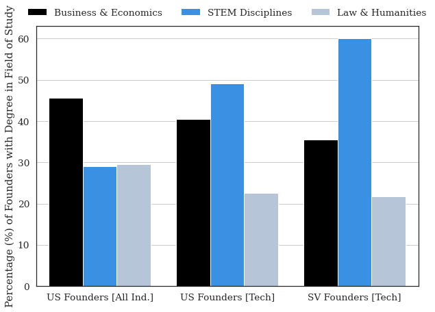

*Note.* Data reports the share of founders who have at least one degree in a particular field of study. Examples of the most common fields of study for each group are reported in Appendix A.D. Note that bars do not sum to one because individuals may have a degree from multiple groups. The results were stratified by different samples along the horizontal axis. **US Founders [All Ind.]** indicates the sample of all US-based founders that have completed LinkedIn profiles from all industries. **US Founders [Tech]** indicates the sample of all US founders who founded a company in the technology sector (*Software, Internet, or Software Services*). **SV Founders [Tech]** indicates the sample of founders based in Silicon Valley (San Matteo and Santa Clara zip codes) who have founded a company in the technology sector (*Software, Internet, or Software Services).*

Below, we provide more detailed breakdowns of the educational backgrounds of founders. For the results reported in this section, we focus on US-based founders of technology companies, and we use a 25% sample.

In **Figure B.B.****2****.**, we report the share of US-based founders of technology companies that report having a particular type of educational degree (Bachelors, Masters, etc.). Approximately 85.6% of founders have a bachelor’s degree, while 5.1% have an associate degree. In terms of post-graduate degrees, 21.2% of founders reported holding a master’s degree (Master of Business Administration [MBA] degrees excluded), while 12.0% of founders reported holding an MBA. A smaller share of founders reported holding other degrees, with 5.1% holding a doctorate (i.e., a PhD), 1.9% holding a law degree (i.e., J.D.), and 0.9% holding a medical degree (i.e., M.D.). It is important to note that these groups are not mutually exclusive. Individuals who have a post-graduate degree are assumed to have an undergraduate degree.

**Figure B.B.****2****.** Percentage of Founders with Educational Degrees [Sample of US-Based Technology Founders]

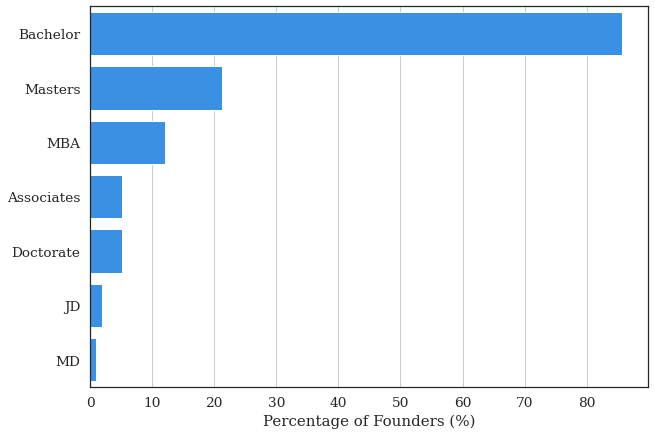

In the subsequent analysis, we explored the specific degrees and institutions from which these individuals graduated. In **Figure B.B.****3****.**, we plot the Field-Of-Study (Top 10 highest frequency) in the undergraduate degree for the sample of US-based founders of technology companies. We aggregate sub-disciplines into broader categories (i.e., combine Mechanical and Electrical Engineering). In addition, we combine degree programs in business, management, commerce, or entrepreneurship. We cluster these into the categories of STEM, Business, or Law and Humanities, consistent with the classification in **Section 3.C**.

**Figure B.B.****3****.** Percentage of Founders with a Bachelor’s Degree in Field-Of-Study [Sample of US-Based Technology Founders]

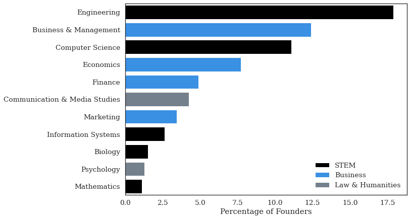

As a further analysis, in **Figure B.B.****4****.**, we stratify the sample by the institutions where these bachelor’s degrees were granted. We separated the sample into degrees that were found in the categories of STEM, Business, or Law and Humanities. Note that this is again based on a random sample of 25% of all founders. Also, keep in mind that these institutions have different sizes of programs; some institutions do not have large undergraduate programs in business (i.e., Stanford or Harvard). Some institutions have very large humanities programs in comparison to the size of their engineering schools (e.g., New York University), while some institutions have very large engineering programs (e.g., the University of Illinois at Urbana-Champaign). With those caveats in mind, the results shown in **Figure B.B.****4** report the proportion of founders that graduate from these universities that have a degree in a particular field-of-study.

**Figure B.B.****4****.** Percentage of Founders with Bachelor’s Degree in Field-of-Study [Sample of US Based Technology Founders]

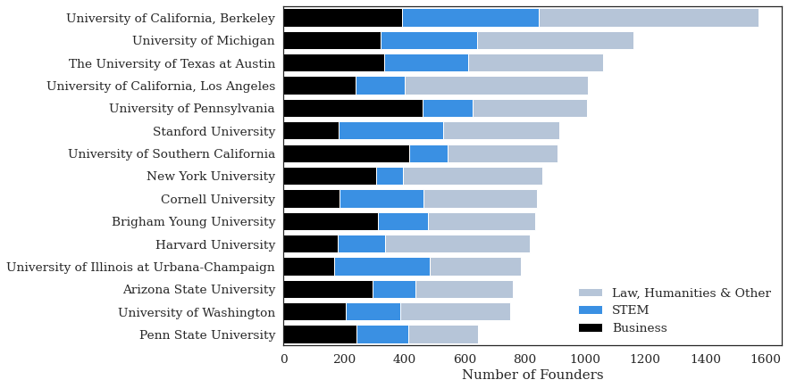

In **Figure B.B.****5****.**, we report the share of founders with master’s degrees. Importantly, we differentiate between two types of degrees: Master of Business Administration (MBA) and all other master’s level degrees. These degrees are typically granted by business schools, and therefore, we report the name of the business school in each case. Again, the same caveats above apply to the difference in the sizes of the program and their specific specialization.

**Figure B.B.****5****.** Percentage of Founders with Master of Business Administration Degrees [Sample of US-Based Technology Founders]

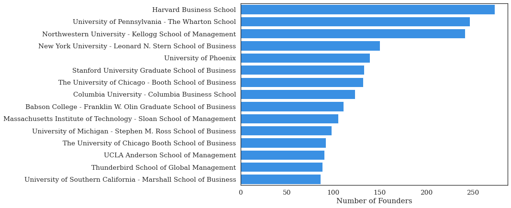

In **Figure B.B.****6****.**, we report the share of founders with master’s degrees excluding MBA graduates.

**Figure B.B.****6****.** Percentage of Founders with Master’s Degrees (MBA Degrees Excluded) [Sample of US-Based Technology Founders]

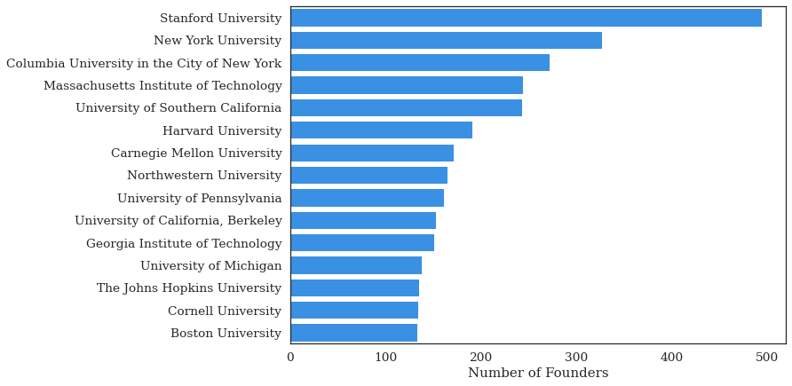

In **Figure B.B.****7**., we report on founders with doctoral degrees, and report the number of founders with degrees from each institution (limited to the Top 15 institutions in terms of number of degrees granted).

**Figure B.B.****7****.** Percentage of Founders with Research-Based Doctorates (PhD) Degrees by Institution [Sample of US-Based Technology Founders]

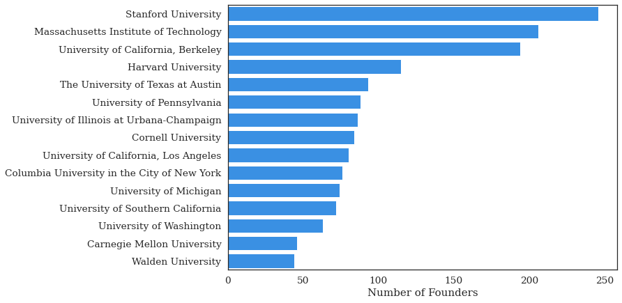

Prior Role of Founders for Non-US Sample

Here, we report the share of founders based in different countries that work in each type of role prior to founding. Countries chosen based on those where there is a large number of founders and large coverage of LinkedIn within the workforce. A sample of founders from the United States is used in the other tables and figures in this paper.

| Position Prior to Founding | Brazil | Canada | France | Germany | Mexico | Spain | United Kingdom | United States |
| --- | --- | --- | --- | --- | --- | --- | --- | --- |
| Academic | 0.08 | 0.09 | 0.06 | 0.13 | 0.06 | 0.08 | 0.07 | 0.10 |
| Business | 0.44 | 0.47 | 0.53 | 0.48 | 0.51 | 0.44 | 0.52 | 0.49 |
| Creative | 0.04 | 0.03 | 0.03 | 0.03 | 0.05 | 0.04 | 0.05 | 0.03 |
| Entrepreneur | 0.15 | 0.12 | 0.12 | 0.14 | 0.12 | 0.12 | 0.11 | 0.12 |
| Other | 0.11 | 0.14 | 0.14 | 0.08 | 0.13 | 0.17 | 0.14 | 0.13 |
| Technical | 0.18 | 0.15 | 0.12 | 0.13 | 0.13 | 0.15 | 0.11 | 0.12 |

**Figure B.C.1.** Prior Role of Founders for Non-US Sample of Countries

Founders Changing Industries

Here, we report the share of technology founders that worked previously (position immediately before founding) from the same industry versus from a different industry. We report the results for individuals previously working in business, technical, or founder roles as these are the roles defined in both the previous and current industry (e.g., founders from academic roles would, by definition, switch industry at the point of founding).

**Figure B.D.1.** Share of Founders that Found in the Same Industry as Their Previous Employer

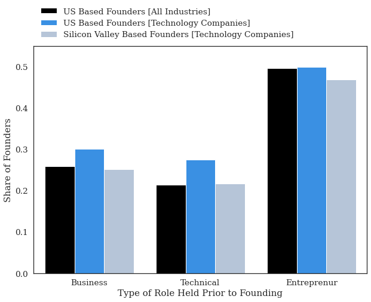

Founders Changing Industries

One common argument for the gender gap that exists in technology industries is the underrepresentation of women in the technical domain, such as engineering or software development. This has prompted research into the factors shaping female participation in the technical domain (Miric, Yin and Fehder 2022; Card and Payne 2021; Carrell, Page, and West 2010; Brenøe and Zölitz 2022). The results thus far suggest that a minority of technology founders come from technical backgrounds. This, in turn, implies that despite the considerable underrepresentation of women in technical roles, this may not be the primary driver of the gender gap in technology entrepreneurship. To explore this further, we stratified our results by gender to further assess the types of roles occupied by founders prior to founding.

In **Figure B.E.1**, we report the share of men and women founders who come from technical, business, serial founding, and academic roles. Consistent with the argument that women are underrepresented in technology roles and technology entrepreneurship, we find that a smaller share of female technology founders have technology backgrounds (17.37%) and that a greater share come from business backgrounds (51.48%) compared to technology founders who are men (25.29% and 46.97%, respectively). However, these differences are quite small (approximately 5–8%), suggesting that they do not fully explain the gender gap that exists in technology entrepreneurship. While women are less likely than men to leave technical roles to found an entrepreneurial venture, the more important result is that only a small share of founders come from technology backgrounds and most have business backgrounds, regardless of their gender. While a greater share of female founders have held academic or creative positions, they account for only a small share of the founders overall.

**Figure B.****E****.1.** Share of Founders that Found in the Same Industry as Their Previous Employer

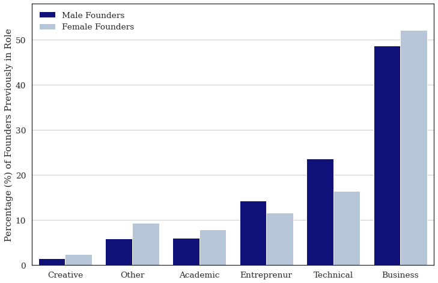

*Note.* Data is based on the position occupied by founders prior to founding their company. Gender was inferred based on the names of the founders. Names that could not be classified are omitted. This figure considers only founders with business and technical backgrounds.

### Appendix C. Additional Regression Results

**Table** **C.1****.** Descriptive Statistics for Regression Analysis (Tables 1 & 2)

| Variable | Mean | S.D. | Min | Max |
| --- | --- | --- | --- | --- |
| Founder in Previous Position | 0.502 | 0.500 | 0 | 1 |
| Found High Growth Venture in Previous Position | 0.015 | 0.121 | 0 | 1 |
|   |   |   |   |   |
| POSITION PRIOR TO FOUNDING |   |   |   |   |
| Technical | 0.284 | 0.451 | 0 | 1 |
| Business | 0.716 | 0.451 | 0 | 1 |
|   |   |   |   |   |
| EDUCATION VARIABLES |   |   |   |   |
| STEM Degree (Any) | 0.330 | 0.470 | 0 | 1 |
| STEM Bachelor Degree | 0.203 | 0.402 | 0 | 1 |
| STEM Masters Degree | 0.084 | 0.278 | 0 | 1 |
| STEM PhD Degree | 0.020 | 0.140 | 0 | 1 |
| Masters Degree (Any) | 0.309 | 0.462 | 0 | 1 |
| MBA (Any) | 0.180 | 0.384 | 0 | 1 |
| Doctorate (Any) | 0.057 | 0.231 | 0 | 1 |
|   |   |   |   |   |
| Founder Gender (MALE) | 0.670 | 0.470 | 0 | 1 |
|   |   |   |   |   |
| Size of Previous Employer Firm |   |   |   |   |
| Only one Employee | 0.004 | 0.064 | 0 | 1 |
| 1 – 10 Employees | 0.072 | 0.258 | 0 | 1 |
| 11 – 50 Employees | 0.129 | 0.335 | 0 | 1 |
| 51 – 200 Employees | 0.130 | 0.336 | 0 | 1 |
| 201 – 500 Employees | 0.079 | 0.269 | 0 | 1 |
| 501 – 1000 Employees | 0.055 | 0.229 | 0 | 1 |
| 1001 – 5000 Employees | 0.122 | 0.327 | 0 | 1 |
| 5001 – 10000 Employees | 0.061 | 0.239 | 0 | 1 |
| 10000 + Employees | 0.349 | 0.477 | 0 | 1 |

**Table** **C.1****.** Results for Likelihood of Founding Among Sample of Big Tech Employees

**Outcome:** *Probability of Founding in Subsequent Position*

***Unit of Observation:*** *Individual Worker Position (Software Developers and Project Managers at Big Tech Companies)*

**Sample:** *Population of Workers (Positions) Working as Project Managers or Software Developers at Large Technology Companies Conditional on Leaving the Company or Founding in Subsequent Position*

|   | (1) | (2) | (3) | (4) |   | (5) | (6) | (7) |
| --- | --- | --- | --- | --- | --- | --- | --- | --- |
|   | Full Sample | Full Sample | Full Sample | Full Sample |   | Matched Sample | Matched Sample | Matched Sample |
|   |   |   |   |   |   |   |   |   |
| Program Manager (Business Role) | 0.452 | 0.461 | 0.491 | 0.434 |   | 0.802 | 0.907 | 0.763 |
| (Baseline: Software Developer) | (0.044) | (0.047) | (0.054) | (0.048) |   | (0.226) | (0.243) | (0.236) |
|   | [0.000] | [0.000] | [0.000] | [0.000] |   | [0.000] | [0.000] | [0.001] |
| STEM Degree (Any) | -0.344 | -0.337 | -0.284 |   |   | 0.167 | 0.298 |   |
|   | (0.052) | (0.052) | (0.067) |   |   | (0.275) | (0.325) |   |
|   | [0.000] | [0.000] | [0.000] |   |   | [0.544] | [0.360] |   |
| Program Manager (Business Role) |   |   | -0.138 |   |   |   | -0.475 |   |
| X STEM (Any Degree) |   |   | (0.113) |   |   |   | (0.524) |   |
|   |   |   | [0.219] |   |   |   | [0.365] |   |
| STEM Bachelor’s degree |   |   |   | -0.097 |   |   |   | 0.124 |
|   |   |   |   | (0.057) |   |   |   | (0.268) |
|   |   |   |   | [0.088] |   |   |   | [0.644] |
| STEM Master’s degree |   |   |   | -0.224 |   |   |   | 0.831 |
|   |   |   |   | (0.102) |   |   |   | (0.601) |
|   |   |   |   | [0.029] |   |   |   | [0.167] |
| STEM Doctorate Degree |   |   |   | -0.959 |   |   |   | -0.049 |
|   |   |   |   | (0.403) |   |   |   | (1.052) |
|   |   |   |   | [0.017] |   |   |   | [0.963] |
| CONTROLS |   |   |   |   |   |   |   |   |
| Education Dummies | Yes | Yes | Yes | Yes |   | Yes | Yes | Yes |
| Gender | Yes | Yes | Yes | Yes |   | Yes | Yes | Yes |
| Year FE |   | Yes | Yes | Yes |   |   |   |   |
| Entry Cohort FE |   | Yes | Yes | Yes |   |   |   |   |
| Matched-Pair FE |   |   |   |   |   |   |   |   |
| MATCHED VARIABLES |   |   |   |   |   |   |   |   |
| Company |   |   |   |   |   | Yes | Yes | Yes |
| Year |   |   |   |   |   | Yes | Yes | Yes |
|   |   |   |   |   |   |   |   |   |
| N | 98403 | 98403 | 98403 | 98403 |   | 82048 | 82048 | 80490 |

**Note.** *Robust Standard Errors in (round) Parentheses. T statistics are reported in [square] brackets. Results based on linear probability model (OLS regression with a binary response variable).*

**Table** **C.2****.** Results for Likelihood of Founding High-Growth Venture based on Career Experience

**Outcome:** *Probability of Founding a High-Growth Venture (More than 500 Employees)*

***Unit of Observation:*** *Individual Worker Position (Prior to Founding)*

**Sample:** *Full Career History of Silicon Valley Based Founders Prior to Founding*

***Model:*** *OLS (Linear Probability Model). Coefficients interpreted as Probability of Founding a High-Growth Venture*

|   | (1) | (2) |   | (3) | (4) |
| --- | --- | --- | --- | --- | --- |
|   |   |   |   |   |   |
| Founder with Business Experience (0/1) | 0.006 |   |   | 0.005 |   |
|   | (0.002) |   |   | (0.002) |   |
|   | [0.005] |   |   | [0.006] |   |
| Years of Business Experience |   | 0.000 |   |   | 0.001 |
|   |   | (0.001) |   |   | (0.000) |
|   |   | [0.717] |   |   | [0.255] |
| Founder with Technical Experience (0/1) | -0.006 |   |   | -0.006 |   |
|   | (0.002) |   |   | (0.002) |   |
|   | [0.011] |   |   | [0.007] |   |
| Years of Technical Experience |   | -0.003 |   |   | -0.002 |
|   |   | (0.001) |   |   | (0.001) |
|   |   | [0.000] |   |   | [0.000] |
| Founder with Academic Experience (0/1) | 0.002 |   |   | 0.001 |   |
|   | (0.003) |   |   | (0.003) |   |
|   | [0.594] |   |   | [0.693] |   |
| Years of Academic Experience |   | -0.002 |   |   | -0.002 |
|   |   | (0.001) |   |   | (0.001) |
|   |   | [0.073] |   |   | [0.091] |
| Founder with Entrepreneurial Experience (0/1) | -0.002 |   |   | -0.003 |   |
|   | (0.002) |   |   | (0.002) |   |
|   | [0.343] |   |   | [0.188] |   |
| Years of Entrepreneurial Experience |   | -0.001 |   |   | -0.001 |
|   |   | (0.001) |   |   | (0.000) |
|   |   | [0.168] |   |   | [0.173] |
| CONTROLS |   |   |   |   |   |
| Founding Year FE | Yes | Yes |   | Yes | Yes |
| Founding Industry FE | Yes | Yes |   | Yes | Yes |
| Year Founder Entered Labor Market |   |   |   | Yes | Yes |
|   |   |   |   |   |   |
| Constant | 0.021 | 0.023 |   | 0.021 | 0.023 |
|   | (0.002) | (0.001) |   | (0.002) | (0.001) |
|   | [0.000] | [0.000] |   | [0.000] | [0.000] |
| N | 25364 | 25364 |   | 25364 | 25364 |
| R2 | 0.134 | 0.137 |   | 0.135 | 0.139 |
| F | 5.651 | 4.799 |   | 6.801 | 5.810 |

**Note.** *Robust Standard Errors in (round) Parentheses. Exact p values to three decimals reported in [square] brackets. Results based on Linear Probability Model (OLS regression with a binary response variable).*

**Table** **C.3****.** Results for Likelihood of Founding High-Growth Venture based on Career Experience

**Outcome:** *Probability of Founding a High-Growth Venture (More than 500 Employees)*

***Unit of Observation:*** *Individual Founders.* **Sample:** *Population of Founders and Founding Teams.*

|   |   | (1) |   | (2) |
| --- | --- | --- | --- | --- |
|   |   |   |   |   |
| Founder Team with Only Business Backgrounds |   | 0.011 |   | 0.009 |
| (Baseline: Founder Team with Only Technical Backgrounds) |   | (0.004) |   | (0.004) |
|   |   | [0.003] |   | [0.014] |
|   |   |   |   |   |
| Founder Team with Mixed Backgrounds |   | 0.016 |   | -0.001 |
| (Baseline: Founder Team with Only Technical Backgrounds) |   | (0.006) |   | (0.007) |
|   |   | [0.016] |   | [0.842] |
|   |   |   |   |   |
| Founder Team with Only STEM Degree (Any) |   | -0.002 |   | -0.002 |
| (Baseline: Founder Team with Non-STEM Degrees) |   | (0.003) |   | (0.003) |
|   |   | [0.629] |   | [0.525] |
|   |   |   |   |   |
| Founder Team with Mixed Degrees |   | 0.049 |   | 0.035 |
| (Baseline: Founder Team with Non-STEM Degrees) |   | (0.008) |   | (0.008) |
|   |   | [0.000] |   | [0.000] |
| CONTROLS |   |   |   |   |
| Founder Industry |   | Yes |   | Yes |
| Founder Team Gender |   | Yes |   | Yes |
| Educational Degrees |   | Yes |   | Yes |
| Year of Founding |   | Yes |   | Yes |
| Founding Team Size |   |   |   | Yes |
|   |   |   |   |   |
| Constant |   | -0.008 |   | -0.010 |
|   |   | (0.020) |   | (0.019) |
|   |   | [0.701] |   | [0.617] |
|   |   |   |   |   |
| N |   | 11968 |   | 11968 |
| R2 |   | 0.054 |   | 0.059 |
| F |   | 10.411 |   | 11.415 |

**Note.** *Robust Standard Errors in (round) Parentheses. T statistics are reported in [square] brackets. Results based on linear probability model (OLS regression with a binary response variable).*